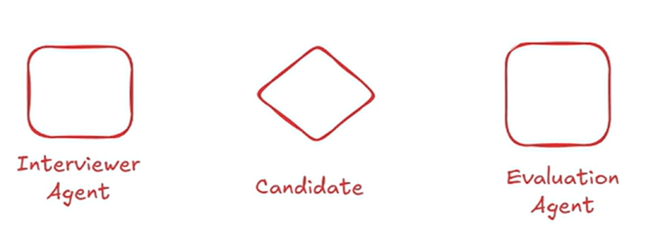
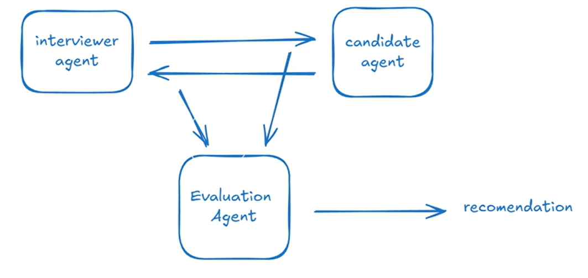
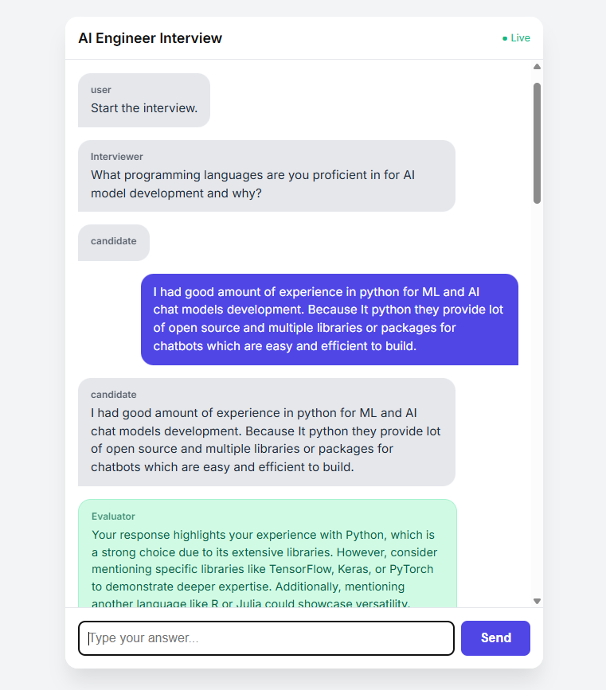

The Automated candidate Interview & Evaluation System (ARIES) is an Agentic AI solution designed to revolutuionize the "Top Of the Funnel" recruitment process. Unlike traditional automation tools that rely on statis keyword matching, ARIES functions as an Autonomous Recruitment Agent. It is capable of perceiving candidate nuances, making real-time decisions during an interview, and independem=ntly synthesizing complex data points into a final recommendation.

## Architecture Overview

- Here the Interviewer Agent works as Interviewer who can ask questions to candidate. And In the backend the Evaluation Agent evaluates the answers and performance of the candidate. Here we can see multi agents which are interacting with each other to evaluate the candidate performance.

## Frameworks Available In The Market For Building Application
- LangGraph
- CrewAI
- n8n (No Code Platform)
- AutoGen
- LangFlow

- Here I'm going with AutoGen Framework because it has Easy and Flexible functionalities compare to other frameworks.

- AutoGen provides two main things like 1. AgentChat, which is a high -level API for building multi-agent applications. It is on top of the autogen-core, 2. Core which is useful for architectural low level programs.  We can do more customized things here.

## Flow Of Whole Appliaction Building

## Env Creation

1. Create Virtual environment
2. Activate the env
3. Install required packages
4. Run the application

## AutoGen Framework Agent Parameters

## Overview Of How Agents communicate and Evaluate Between Them

## Web Interface For Candidadte Interview And Evaluation System

